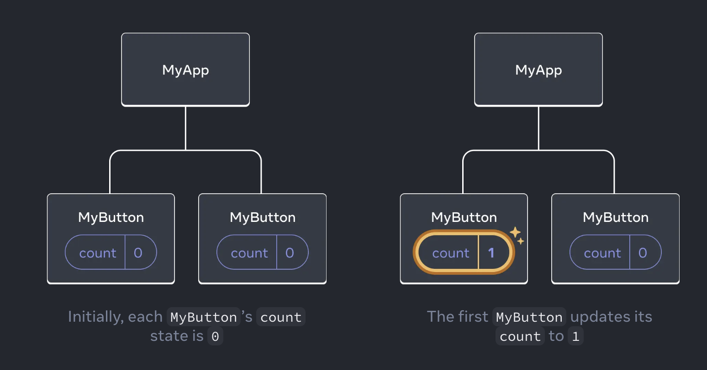
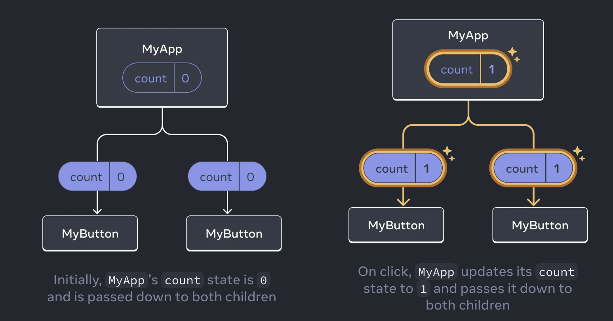

# Intro to Typescript and React

A brief introduction

<div class="absolute bottom-10">
  <span class="font-700">
    Per Enström – 2025-01-14
  </span>
</div>

---

# What you will know after these 30 minutes

* Everything about Typescript
* Everything about React

---
layout: center
---


---

# What you will know after these 30 minutes

* Some basics about Typescript
* Some basics about React
* Where to learn more

---
layout: section
---

# Typescript

---

# Typescript

* Official documentation can be found at [www.typescriptlang.org/docs](https://www.typescriptlang.org/docs)
* For experimentation, use the playground at [www.typescriptlang.org/play/](https://www.typescriptlang.org/play/)

---

# Typescript

* Builds on un-typed Javascript, extending it with types
* Transpiles (compiles) down to plain Javascript

```ts
const myString: string = "hello";

const myFunction = (input: string) => {
   console.log(input);
}

myFunction(myString);
```

_compiles to_

```js
"use strict";
const myString = "hello";
const myFunction = (input) => {
    console.log(input);
};
myFunction(myString);
```

---

# Typescript

* Types are sets of types, not necessarily a single type

```ts
type MySingleType = string;
type MyUnionType = string | number;
```

---

# Typescript

* Typescript's job is to prevent runtime javascript errors
* If Javascript doesn't care, Typescript won't care
* Structural typing
* So-called duck-typing (if it quacks and looks like a duck, it's a duck)
* Don't need to specify types that can be inferred

---

```ts  {all|1-7|9-15|17-21|23-24|all} twoslash
interface Pointlike {
  x: number;
  y: number;
}
interface Named {
  name: string;
}
 
function logPoint(point: Pointlike) {
  console.log("x = " + point.x + ", y = " + point.y);
}
 
function logName(x: Named) {
  console.log("Hello, " + x.name);
}
 
const obj = {
  x: 0,
  y: 0,
  name: "Origin",
};
 
logPoint(obj);
logName(obj);
```

---

# Typescript

* Common to feel worked against by TS
* Libraries often come with very advanced TS patterns
  * Sometimes helpful to 'cmd-click' into a bundled type
* Error messages are hard to understand
  * Read from bottom up
  * Install VS Code extension "Pretty TypeScript Errors"

---

# Typescript

* Don't use the escape hatch `any`
  * Completely disables typechecking
  * When starting out, tempting to sprinkle `any` everywhere just to get past a problem
  * There's always a reason you get an error

---
layout: section
---

# React

---

# React

* Official documentation can be found at [react.dev/learn](https://react.dev/learn)

---

# React

* Made up of _components_
* A component is a UI piece, with logic and appearance
* Small as a button, or large as a page
* Most of the time nested within each other
* All components are just javascript functions which return markup (JSX)
* Components are named with a capital letter
* Most often one component per file (.tsx)

---

# React

_Button component:_
```tsx
function MyButton() {
  return (
    <button>I'm a button</button>
  );
}
```

_Page component:_
```tsx
function MyApp() {
  return (
    <div>
      <h1>Welcome to my app</h1>
      <MyButton />
    </div>
  );
}
```

---

# React

* JSX is stricter than HTML
  * You have to close all tags, even self-closing (`<br />` instead of `<br>`)
  * A React function can only return a single root tag (you can solve this by using fragments)
  * Some conflicting html properties are renamed (`class` becomes `className`, `for` becomes `htmlFor`)

```tsx
function AboutPage() {
  return (
    <>
      <h1>About</h1>
      <p>Hello there.<br />How do you do?</p>
    </>
  );
}
```

_`<>` is just shorthand syntax for `<React.Fragment>`_

---

# React

* JSX lets you 'go back' to a Javascript expression by using `{}`
* This is evaluated as a single expression, so cannot contain statements like `if`/`else`

```tsx
return (
  
);
```

---

# React

* Conditional rendering is often done by using `?` or `&&` operators

```tsx
<div>
  {isLoggedIn ? (
    <AdminPanel />
  ) : (
    <LoginForm />
  )}
</div>
```

> *if* `isLoggedIn` *then* render `<AdminPanel />` *else* render `<LoginForm />`

```tsx
<div>
  {isLoggedIn && <AdminPanel />}
</div>
```

> _This is just a boolean comparison. In JS, a boolean comparison returns the last element compared if all evaluate to `true`. And if any part of a comparison evaluates to `false`, then an early exit is made and `false` is returned. So in this case, if `isLoggedIn` is true, check if `<AdminPanel />` is true(ish), and if so, return that._

<style>
blockquote {
  margin-block: 1rem;
}
</style>

---

# React

* Components can hold _state_, and pass down _state_ to children components as _props_. Children can affect parent component by calling functions that has been passed to them as _props_.
* State only flows downwards in the component tree, never up
* React will re-render a component whenever its state or props change

---

# React
## State

```tsx
import { useState } from 'react';

function MyButton() {
  const [count, setCount] = useState(0);
  
  return (
    <>
      Count is: {count}
      <button>Increment</button>
    </>
  )
}
```

> Here the type of `count` is inferred to be a number based on the default value, without us having to explicitly type it

<style>
blockquote {
  margin-block: 1rem;
}
</style>

---

# React
## Handlers

```tsx
import { useState } from 'react';

function MyButton() {
  const [count, setCount] = useState(0);

  function handleClick() {
    setCount(count + 1);
  }
  
  return (
    <>
      Count is: {count}
      <button onClick={handleClick}>Increment</button>
    </>
  )
}
```

<style>
blockquote {
  margin-block: 1rem;
}
</style>

---

# React
## Moving state up

* A common pattern when you want components to share some piece of data is to move that data up to the nearest common parent.

<v-switch>
  <template #1>

  

  </template>
  <template #2>

  

  </template>
</v-switch>

<style>
img {
  width: 40rem;
}
</style>

---
layout: two-cols-header
---

# React
## Moving state up

* A common pattern when you want components to share some piece of data is to move that data up to the nearest common parent.

::left::

```tsx
function MyApp() {
  const [count, setCount] = useState(0);

  function handleClick() {
    setCount(count + 1);
  }

  return (
    <div>
      <h1>Counters that update together</h1>
      <MyButton count={count} onClick={handleClick} />
      <MyButton count={count} onClick={handleClick} />
    </div>
  );
}
```

::right::

```tsx
function MyButton(props) {
  return (
    <button onClick={props.onClick}>
      Clicked {props.count} times
    </button>
  );
}
```

<style>
.two-cols-header {
  gap: 1rem;
}
</style>

---
layout: section
---

# Let's get coding!
