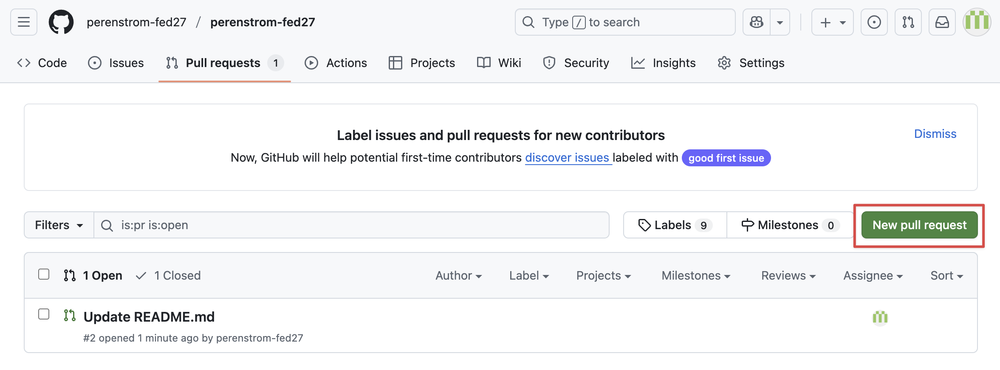

# Intro to Git and Github

Hyper Island - FED27

<div class="absolute bottom-10">
  <span class="font-700">
    Per Enström – 2025-09-05
  </span>
</div>

---
layout: two-cols-header
---

# Agenda

::left:: 

* Who am I?
* Terminal / Command prompt / Powershell
  * ***Exercise: Installing Git***
  * ***Exercise: Terminal***
* Git & github
* Git 1 - Basics
  * ***Exercise: Git 1 - Init and committing***
* Git 2 - Branches and merging
  * ***Exercise: Git 2 - Branching and merging***
* Git 3 - Rebasing
  * ***Exercise: Git 3 - Rebasing***

::right::

* Git 4 - Conflict management
  * ***Exercise: Git 4 - Conflict management***
* Git 5 - Remotes etc.
* Github 1 - Basics
  * ***Exercise: Github 1 - Creating your profile***
* Github 2 - Github Pages and more
  * ***Exercise: Github 2 - Adding your personal website to github***
* Git GUI clients
* Browser debugging

---

# Who am I?

Frontend developer

* Cancerfonden
* Volvo Cars
* Swish
* Important Looking Pirates VFX

---

# Terminal

* Used to navigate and control your computer via text
* Mac: Terminal
* Windows: Command Prompt, Powershell (or third party programs)
* Always has a context of the folder it's running in

---

# Terminal

## Paths

_How to know where you are, and where to go_

Paths are defined in a similar way as a web page, an address separated by slashes

`/Users/perenstrom/desktop` <ri-apple-fill />, or `C:\Users\perenstrom` <ri-windows-fill />

---

# Terminal

## Paths

### Absolute path

* Starts at your hard drive
* Begins with `/` <ri-apple-fill /> or `C:\` <ri-windows-fill />
* `/Users/perenstrom/desktop` will always mean the `desktop` folder inside your user folder, no matter where you are

### Relative path

* Starts at your current position
* If you're in your user folder, `desktop/images` means the folder named `images` inside the folder named `desktop` inside your user folder
* If you're in a folder called `myfolder`, `desktop/images` means the folder named `images` inside the folder named `desktop` inside the folder `myfolder`

---

# Terminal

## Paths

### Special folder names

* `.` (period) means the current folder, so `./desktop/images` is the same as `desktop/images`
  * sometimes needed to explicitly specify
* `..` means the parent folder, so if you're in your user folder `..` means the `Users` folder
  * If you're in your desktop folder `../downloads` means the `downloads` folder inside your user folder (one step up, and then into Downloads)

---

# Terminal

## Navigating, creating folders, and listing content

* To move around in your terminal, you use the `cd` command
  * If you're in your user folder, `cd desktop` means to enter the desktop folder
  * Likewise, using absolute paths, `cd /Users/perenstrom/desktop`

> If you wonder where you are, just type `pwd` and the terminal will print the current folder

<div class="p-2" />

* To list the contents of the folder you're in, use `ls` <ri-apple-fill /> or `dir` <ri-windows-fill />
  * Some commands have options, or flags, a dash and a letter, to change the behavior
  * For example, the `ls` command has a flag `-l` to give a more detailed list of the folder contents
  * To use this, type the command `ls -l` instead

---

# Terminal

## Navigating, creating folders, and listing content

* To create a folder inside the current folder, use the command `mkdir`
  * This command (and many others) take an input, written after the command. In this case the name of the folder to create
  * To create a folder called `my-folder`, type `mkdir my-folder`

---

# Terminal

## Good to know

* Use <kbd>tab</kbd> to autocomplete commands and folders
  * If you start to type `cd /Users/per` and press <kbd>tab</kbd> the terminal will autocomplete to `cd /Users/perenstrom/`
* Use <kbd>up arrow</kbd> to step back through your history of commands, which can be handy if you don't want to type a command again and recently used it

---
layout: section
---

# Exercise - Installing Git
# Exercise - Terminal

---

# Git

## What is it

* Version management
  * Instead of creating assignment.docx, assignment-2.docx, assignment-final.docx, assignment-final-2.docx, assignment-final-final-for-real.docx
  * Like the version history in Google Docs, or Dropbox
  * Like the history in Photoshop
* Manual control over every step in the history, we decide ourselves when and what to add as a history step

---

# Git

## Why do we use it?

* Makes it easy to see when something was introduced or removed in your code base
* Allows you to work on different branches of your code
* Makes collaborating on code seamless
* Allows us to easily release new versions when we're done with a feature, instead of always doing changes in the published web page

---

# Git

## Important!

**Don't add sensitive information (API Keys, passwords, etc) to git!**

While we _can_ rewrite the git history, it's a pain, and once a password has been added to the history it's visible forever.

---

# Git

## Repository

A project in Git is called a _repository_. The repository contains a hidden folder that contains all information related to git, the full history, different branches, etc.

We create a new repository for every project or web site.

To initialize a repository in a folder on our computer we use the command `git init`. This creates an empty repository in that folder, ready to accept our changes.

---

# Git

## Commit

* Every change in a git history is called a _commit_. It's a change we _commit_ to.
* Every commit is stored as a difference between the previous step and the next, i.e. we don't store all code in all steps, only what has changed.
* These differences are called _diffs_.
* These changes can then be used to go back in time to any point in the code base's history.
* Every commit has an accompanying _commit message_ that we write ourselves
  * The commit message should be brief and descriptive of the change
  * *The Will Rule*, any commit message should make sense if we say "This commit will" before the message
    * Good: "Add an image", "Fix bug in login", "Rework the home page"
    * Bad: "Added image", "Fixed bug", "Reworked the home page", "fix", "asdfasdfa"

---

# Git

## The stage, and tracking

* To commit changes to a file, we need to tell Git to _track_ that file
* All files start out untracked
* Every uncommitted change we are working on needs its file to be tracked, and then added to _the stage_, before we can commit it
* We can – and often do – stage only part of what we've changed and commit that
* Tracking and staging are conveniently done in one command, the `git add` command
  * `git add` takes a third parameter which is the file we want to track and stage
  * If we want to track and stage a file called `index.html`, we use the command `git add index.html`
  * We can also track and stage all changed files at the same time with `git add .` (notice the period)

---

# Git

## How often do we commit?

* General rule is to commit small and often
  * This could be several times an hour, or a couple of times a day
* A goal is that the code base is always working at every commit
  * This means that when we're building web apps in Javscript, we should not commit code that is in a state that doesn't work
  * Doing many small commits is very helpful when collaborating, it makes it easy to track how files have evolved over time, and makes combining different changes from different people much easier

---
layout: section
---

# Exercise
# Git 1: Init and committing

---

# Git

## Branches

* All commits in a git repository belongs to a branch
* By default a branch called `main` (or previously `master`) is created when initializing a repository
* We can look at all commits of a repository a bit like a tree, with branches of code diverging off, and unlike a tree merge together with the trunk again
* Branches are used heavily in development
  * Usually we have a `main` branch, which is always released to our url on the web
  * From that we branch off different branches where we can work on new features
  * On these branches we follow the commit small and often tactic
  * When we're done with our feature, we merge it back into `main` and release it to our users

---

# Git

## Branches

* Switching between branches are called Checking out
* To create a new branch and check it out we use the command `git checkout -b my-branch-name`
* Creating new branches are always made from the branch you currently have checked out, nothing is preventing us from branching from a branch
* In the terminal you will see what branch you're currently on, in my terminal it says `git: (main)` when I'm on the `main` branch

---

# Git

## Merging

* To merge our branch back into another branch we use the command `git merge`
* We merge a target branch, into the branch we have checked out
  * To merge a branch called `my-branch-name` into `main`, we first `git checkout main`, and then `git merge my-branch-name`
* There are a few merge _strategies_ that git automatically choses between
  * The two common ones are _fast-forward_ and _merge commit_
  * _fast-forward_ takes all commits on our `my-branch-name` and adds them one by one to the `main` branch
  * _merge commit_ takes all our commits and mashes them together, and creates a new single commit on `main` with all of our changes
* Merging does not delete a branch, we can continue to commit to either branch afterwards

---
layout: section
---

# Exercise
# Git 2: Branching and merging

---

# Git

## Rebasing

* Often when working on a project with others, stuff will change on `main` while you are working on your feature branch.
* We often want to incorporate those newest changes on `main` in our feature branch and continue our work.
* To do this we can either _merge_ or _rebase_
  * Merging is the easiest, where we merge `main` into our branch (by checking out our feature branch and doing `git merge main`)
  * Rebasing means taking all of the commits we've done on our feature branch, and applying them one by one on the new state of `main`. This makes it look like we really started our branch from the latest commit on `main``
    * Rebasing makes for a cleaner git history, but can be a bit tricky to do

---
layout: section
---

# Exercise
# Git 3: Rebasing

---

# Git

## Merge conflicts

* When the same line has changed in two different branches and we try to merge them together, we will encounter a _merge conflict_
* This means that Git can't automatically figure out what version to keep, and we have to help it out
* Merge conflicts pauses a merge in a conflict stage, and waits for you to resolve the files and commit the correct version
* In the conflicting file it will look something like:

```
<< HEAD
This is how the line looks on our current branch
=======
This is how the line looks on the branch we want to merge into our
>> main
```

* We select our change by replacing this whole block of five lines with the single line we want to keep
* We then commit this change with `git add .` and `git commit -m "merge branch main into feature"`

---

# Git

## Merge conflicts

* Merge conflicts often occur when we're done with a feature and want to merge it into `main`, when something has happened on `main`
* Best practice is to:
  * merge the other way around first, merge `main` into our feature branch
  * resolve the merge conflict on our feature branch and commit that
  * merge the feature branch into `main`, which should now be conflict free

---
layout: section
---

# Exercise
# Git 4: Conflict management

---

# Git

## Stashing

* Sometimes you want to switch branch to look at something on another branch, but you have changed some files that you are not ready to commit yet
* You can use `git stash` to temporarily store your ongoing changes without committing them
* You can then switch between branches, do your thing, and then come back to your branch
* When you're ready to continue your ongoing work, use `git stash pop` to bring your changes out from storage

---

# Git

## Amending

* You can change your last commit if you noticed that you did something wrong and don't want to make a whole new commit to fix that, or if you want to change your commit message
* If you want to add a new change, add the file with `git add .`
* Then commit while using the `--amend` flag: `git commit --amend -m "My edited message"`

---

# Git

## Remotes: Push and Pull

So far we've only worked with a local git repository on your computer, but this is usually not the case. Usually our code repository is also stored somewhere online, in for example GitHub (which we'll come to later). These remote locations of your local repository is called _remotes_. 

* Remotes are other locations of your repository
* A local branch is usually tied to a remote branch
* To fetch the latest changes of a branch from the remote (say if the code has changed on github by one of your colleagues), you _pull_ those changes to your local branch
* When you have done something to a local branch and want to upload it to the remote, you _push_ your changes to the remote branch

---

# Git

## Bonus: Git på svenska

When talking about Git in Swedish, things get weird quite quickly

> "Kan du pulla mina ändringar till branchen?"

A GitHub user named Björn has made a list of Swedish terms for the Git terms we've come across, to make it easier to communicate with fellow Swedes. Some examples:

> "Kan du rycka grenen jag just ympade och knuffa till github?"

<div class="p-2"/>

> "Skicka en ryckbegäran när du är färdig med sammanfogningen!"

<div class="p-2"/>

> "Hoppsan, jag råkade visst kraftknuffa mot mäster-grenen"

Full list at: https://github.com/bjorne/git-pa-svenska

<small><i>Full disclaimer, no-one uses this</i></small>

---

# GitHub

## Git vs Github

* Git is the underlying mechanic of committing changes etc.
* GitHub is a web service which can act as a remote for your repositories
* GitHub also adds additional functionalities and work flows for a complete development management solution
* GitHub is owned by Microsoft (and since recently moved to their _AI_ department...)

---

# GitHub

## Repositories

* In GitHub you can create your own repositories, or be have access to other's repositories
* Repositories can be _Private_ (hidden to anyone without access), or _Public_ (visible to anyone)
* Repositories (and users) can be part of organizations, which in turn can have their own repositories

---

# GitHub

## Anatomy of a repository - Code tab

Code tab – A repository's home page, allows you to browse the source code and read the README


---

# GitHub

## Anatomy of a repository - Code tab

Watching repositories – Watched repositories gives you a notification if something happens in them


---

# GitHub

## Anatomy of a repository - Code tab

Starring repositories – A bit like _liking_. Can be a good indicator of how good a tool is


---

# GitHub

## Anatomy of a repository - Code tab

Forking repositories – If you want to create your own version from another repository, you fork that repository


---

# GitHub

## Anatomy of a repository - Code tab

Cloning – If you press the Code button, you will get info on how to clone (create a local copy) the repository


---

# GitHub

## Anatomy of a repository – Issues tab

Issues – Can be used for project management, or bug reporting for your users


---

# GitHub

## Anatomy of a repository – Projects tab

Projects – Used to organize issues, track goals, etc.


---

# GitHub

## Anatomy of a repository – Projects tab

Projects – Used to organize issues, track goals, etc.


---

# GitHub

## Anatomy of a repository – Pull requests tab

Pull Requests – When you have made changes and want to merge them into a project on GitHub, you open a Pull Request (PR). Named because you want the repository to _Pull_ your changes into their code base, another name could be "Merge request".

Vital for collaboration with others. Every time a change you've made are to be added to the product, you open a PR, your colleagues review and approve it, and then you merge it.


---

# GitHub

## Anatomy of a repository – Pull requests tab

To open a new PR, press the New pull request button. 



---
layout: two-cols-header
---
# GitHub

## Anatomy of a repository – Pull requests tab

In the top you will select target branch, and source branch.

::left:: 

* Fill in a good descriptive title of your change (1)
* Write a description of your change (2)
* Assign yourself (usually) (3)
* Add reviewers if needed (4)
* Press Create pull request (5)

::right::


---

# GitHub

## Anatomy of a repository – Pull requests tab

The PR page now display a timeline of changes, with your description at the start.


---

# GitHub

## Anatomy of a repository – Pull requests tab

The Commits tab shows all commits that has been made on the branch you want to merge.


---

# GitHub

## Anatomy of a repository – Pull requests tab

The Files changed tab shows all the files that has changed, and all changes in those files.

Here we see that I've changed line 3, the red part is the old one, and the green part is the new.


---

# GitHub

## Anatomy of a repository – Pull requests tab

If you hover a line, a plus appears which you can click to add a comment. This comment can either be posted directly, or added to a Review.


---

# GitHub

## Anatomy of a repository – Pull requests tab

To review someone else's changes (or your own I guess), press the Review changes (or Finish your review), add a comment, choose if you approve or want some changes to be made, and press Submit review.


---

# GitHub

## Anatomy of a repository – Pull requests tab

Our colleagues review can now be seen in the Conversation tab.

<div class="w-130">

</div>

---

# GitHub

## Anatomy of a repository – Pull requests tab

If you want, you can reply to comments, and/or mark a conversation as "resolved"


---

# GitHub

## Anatomy of a repository – Pull requests tab

When everyone is happy, press the Merge pull request to merge your changes into the target branch!


---

# GitHub

## Anatomy of a repository – Pull requests tab

The merge event can now be seen in the history, and there's a Delete branch button to remove your branch (if it was temporary). This deletion can always be reverted!

